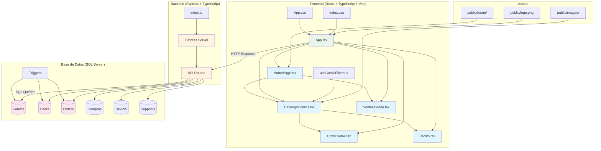
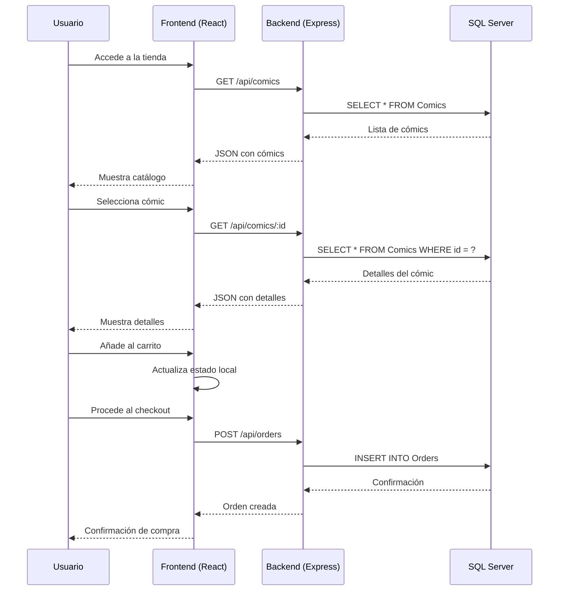

# Tienda de Cómics

Proyecto fullstack para gestionar y visualizar cómics usando React, TypeScript, Vite (frontend) y Express + SQL Server (backend).

## Arquitectura del Sistema



## Flujo de Datos



## Características
- Visualización de catálogo de cómics
- Consulta de cómics desde base de datos SQL Server
- Navegación con React Router
- Estilos modernos con CSS

## Instalación

### Frontend (Vite + React)
```bash
npm install
```

### Backend (Express)
```bash
cd server
npm install
```

## Ejecución

### Frontend
```bash
npm run dev
```

### Backend
```bash
cd .\server\
npx tsc
node dist/index.js
```
o si tienes TypeScript:
```bash
npx ts-node index.ts
```

## Estructura del proyecto
- `src/` : Código fuente del frontend
  - `components/` : Componentes reutilizables (ej. CatalogoComics)
  - `App.tsx` : Componente principal
- `server/` : Backend Express y scripts SQL
  - `index.ts` : Servidor Express principal
  - `sql/` : Scripts y consultas SQL

## Uso
1. Asegúrate de tener una base de datos SQL Server con la tabla `Comics`.
2. Configura las variables de entorno en `server/.env`:
   - `DB_SERVER`, `DB_DATABASE`, `DB_USER`, `DB_PASSWORD`, `PORT`
3. Inicia el backend y frontend como se indica arriba.
4. Accede a la app en [http://localhost:3000](http://localhost:3000).

## Personalización
Agrega tus cómics en la base de datos y personaliza los estilos en `App.css`.

# React + TypeScript + Vite

This template provides a minimal setup to get React working in Vite with HMR and some ESLint rules.

Currently, two official plugins are available:

- [@vitejs/plugin-react](https://github.com/vitejs/vite-plugin-react/blob/main/packages/plugin-react) uses [Babel](https://babeljs.io/) for Fast Refresh
- [@vitejs/plugin-react-swc](https://github.com/vitejs/vite-plugin-react/blob/main/packages/plugin-react-swc) uses [SWC](https://swc.rs/) for Fast Refresh

## Expanding the ESLint configuration

If you are developing a production application, we recommend updating the configuration to enable type-aware lint rules:

```js
export default tseslint.config([
  globalIgnores(['dist']),
  {
    files: ['**/*.{ts,tsx}'],
    extends: [
      // Other configs...

      // Remove tseslint.configs.recommended and replace with this
      ...tseslint.configs.recommendedTypeChecked,
      // Alternatively, use this for stricter rules
      ...tseslint.configs.strictTypeChecked,
      // Optionally, add this for stylistic rules
      ...tseslint.configs.stylisticTypeChecked,

      // Other configs...
    ],
    languageOptions: {
      parserOptions: {
        project: ['./tsconfig.node.json', './tsconfig.app.json'],
        tsconfigRootDir: import.meta.dirname,
      },
      // other options...
    },
  },
])
```

You can also install [eslint-plugin-react-x](https://github.com/Rel1cx/eslint-react/tree/main/packages/plugins/eslint-plugin-react-x) and [eslint-plugin-react-dom](https://github.com/Rel1cx/eslint-react/tree/main/packages/plugins/eslint-plugin-react-dom) for React-specific lint rules:

```js
// eslint.config.js
import reactX from 'eslint-plugin-react-x'
import reactDom from 'eslint-plugin-react-dom'

export default tseslint.config([
  globalIgnores(['dist']),
  {
    files: ['**/*.{ts,tsx}'],
    extends: [
      // Other configs...
      // Enable lint rules for React
      reactX.configs['recommended-typescript'],
      // Enable lint rules for React DOM
      reactDom.configs.recommended,
    ],
    languageOptions: {
      parserOptions: {
        project: ['./tsconfig.node.json', './tsconfig.app.json'],
        tsconfigRootDir: import.meta.dirname,
      },
      // other options...
    },
  },
])
```
