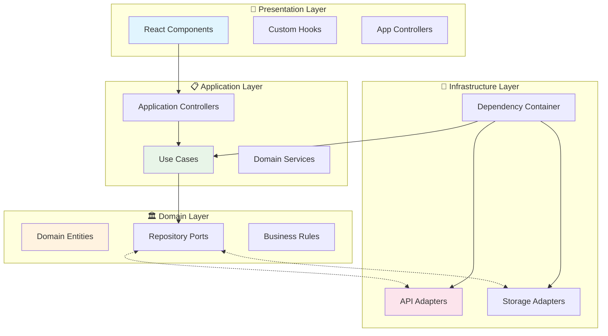

# 🦸‍♂️ Hexagonal Comic Store

Una aplicación fullstack de tienda de cómics construida con **Arquitectura Hexagonal (Clean Architecture)**, React + TypeScript (frontend) y Express + SQL Server (backend).

## 🏗️ Arquitectura Hexagonal

Este proyecto implementa una arquitectura hexagonal perfecta, garantizando separación de responsabilidades, testabilidad y mantenibilidad:



### 📂 Estructura de Capas

```
src/
├── 🎨 presentation/
│   ├── components/           # Componentes React
│   │   ├── common/          # Componentes reutilizables
│   │   │   ├── ErrorBoundary.tsx
│   │   │   ├── Button.tsx
│   │   │   └── LoadingSpinner.tsx
│   │   ├── CatalogoComics.tsx
│   │   ├── ComicDetail.tsx
│   │   ├── HomePage.tsx
│   │   ├── VentasTienda.tsx
│   │   └── Carrito.tsx
│   └── hooks/               # Hooks personalizados
│       └── useComicFilters.ts
├── 📋 application/
│   ├── usecases/            # Casos de uso del negocio
│   │   ├── GetComicsUseCase.ts
│   │   ├── CartUseCase.ts
│   │   ├── CheckoutUseCase.ts
│   │   └── GetComicFiltersUseCase.ts
│   ├── controllers/         # Controladores de aplicación
│   │   └── AppController.ts
│   └── services/           # Servicios transversales
│       └── NavigationService.ts
├── 🏛️ domain/
│   ├── entities/           # Entidades de dominio
│   │   ├── Comic.ts
│   │   └── CartItem.ts
│   └── repositories/       # Puertos (interfaces)
│       ├── ComicRepository.ts
│       ├── CartRepository.ts
│       └── OrderRepository.ts
└── 🔧 infrastructure/
    ├── api/                # Adaptadores API
    │   ├── ApiComicRepository.ts
    │   └── ApiOrderRepository.ts
    ├── storage/            # Adaptadores de almacenamiento
    │   └── LocalStorageCartRepository.ts
    └── DependencyContainer.ts # Inyección de dependencias
```

## ✨ Características Principales

### 🛍️ **Funcionalidades de la Tienda**
- **Catálogo Interactivo**: Navegación fluida por cómics con filtros avanzados
- **Carrito Inteligente**: Persistente en localStorage con gestión de cantidades
- **Checkout Completo**: Proceso de compra integrado con base de datos
- **Dashboard de Ventas**: Análisis de ventas con gráficos (Recharts)
- **Sistema de Reviews**: Reseñas y valoraciones de usuarios

### 🏗️ **Arquitectura y Desarrollo**
- **Arquitectura Hexagonal**: Separación perfecta de responsabilidades
- **Clean Code**: TypeScript estricto con importaciones de tipos
- **Error Boundaries**: Manejo robusto de errores
- **Componentes Reutilizables**: Sistema de componentes modular
- **Estado Centralizado**: Gestión de estado con hooks personalizados
- **Navegación Centralizada**: Servicio de navegación singleton

### 🎨 **UI/UX Moderna**
- **Diseño Responsive**: Adaptable a todos los dispositivos
- **Tema Oscuro**: Interfaz moderna con colores consistentes
- **Animaciones Suaves**: Transiciones y hover effects
- **Loading States**: Indicadores de carga apropiados
- **Feedback Visual**: Estados de éxito, error y carga

## 🚀 Instalación y Configuración

### Prerrequisitos
- Node.js 18+
- SQL Server
- npm o yarn

### 🎯 Frontend (React + Vite)
```bash
# Instalar dependencias
npm install

# Desarrollo
npm run dev          # Puerto 3000

# Construcción
npm run build        # Builds TypeScript + Vite
npm run lint         # ESLint
npm run preview      # Preview build
```

### ⚡ Backend (Express + TypeScript)
```bash
cd server

# Instalar dependencias
npm install

# Desarrollo
npx ts-node src/main.ts     # Desarrollo directo
# o
npx tsc && node dist/main.js # Compilar y ejecutar
```

### 🗄️ Base de Datos
```bash
# Configurar variables de entorno en server/.env
DB_SERVER=your_sql_server
DB_DATABASE=ComicsStore
DB_USER=your_username
DB_PASSWORD=your_password
PORT=4000

# Ejecutar scripts SQL desde server/sql/
```

## 🌐 API Endpoints

### 📚 Comics
- `GET /comics` - Obtener cómics con filtros
- `GET /comics/filters` - Opciones de filtros disponibles
- `GET /comics/:id` - Obtener cómic específico

### 📝 Reviews
- `GET /reviews/:comic_id` - Reviews de un cómic específico

### 🛒 Orders
- `POST /orders` - Crear nueva orden

### 📊 Analytics
- `GET /ventas` - Datos de ventas
- `GET /ventas-mensuales` - Análisis mensual

## 🔧 Configuración de Desarrollo

### Variables de Entorno

**Frontend (.env)**
```env
VITE_API_BASE_URL=http://localhost:4000
```

**Backend (server/.env)**
```env
DB_SERVER=localhost
DB_DATABASE=ComicsStore
DB_USER=your_user
DB_PASSWORD=your_password
PORT=4000
```

### Scripts Disponibles

**Frontend:**
- `npm run dev` - Servidor de desarrollo
- `npm run build` - Build para producción
- `npm run lint` - Linting con ESLint
- `npm run preview` - Preview del build

**Backend:**
- `npx tsc` - Compilar TypeScript
- `npx ts-node src/main.ts` - Desarrollo directo
- `node dist/main.js` - Ejecutar build compilado

## 🎯 Principios de Arquitectura Implementados

### ✅ **SOLID Principles**
- **S**: Cada clase/componente tiene una responsabilidad única
- **O**: Abierto para extensión, cerrado para modificación
- **L**: Las implementaciones son intercambiables
- **I**: Interfaces segregadas y específicas
- **D**: Dependencia de abstracciones, no concreciones

### ✅ **Hexagonal Architecture**
- **Ports & Adapters**: Interfaces en domain, implementaciones en infrastructure
- **Dependency Inversion**: Use cases dependen de abstracciones
- **Inside-Out**: El dominio no conoce la infraestructura
- **Testability**: Fácil testing con mocks

### ✅ **Clean Code**
- **TypeScript Estricto**: Tipos explícitos y validación
- **Error Handling**: Boundaries y manejo consistente de errores
- **Separation of Concerns**: Cada capa con responsabilidad específica
- **Dependency Injection**: Container centralizado

## 📋 Tareas de Desarrollo Comunes

### Agregar Nuevo Use Case
1. Crear interface en `domain/repositories/`
2. Implementar use case en `application/usecases/`
3. Crear adaptador en `infrastructure/`
4. Registrar en `DependencyContainer`

### Agregar Nuevo Componente
1. Crear componente en `components/`
2. Usar hooks existentes para estado
3. Implementar error boundaries
4. Añadir a `components/common/` si es reutilizable

### Modificar Entidades
1. Actualizar interfaces en `domain/entities/`
2. Actualizar repositorios relacionados
3. Ajustar use cases afectados
4. Actualizar adaptadores

## 🧪 Testing

El proyecto está preparado para testing con:
- **Unit Tests**: Para use cases y entidades
- **Integration Tests**: Para adaptadores
- **Component Tests**: Para componentes React
- **E2E Tests**: Para flujos completos

## 🔄 Estados de la Aplicación

- **Loading**: Spinners y estados de carga
- **Error**: Error boundaries y mensajes de error
- **Empty**: Estados vacíos con mensajes informativos
- **Success**: Feedback de operaciones exitosas

## 🏆 Beneficios de esta Arquitectura

- ✅ **Mantenibilidad**: Código organizado y fácil de modificar
- ✅ **Testabilidad**: Fácil testing con dependency injection
- ✅ **Escalabilidad**: Fácil agregar nuevas funcionalidades
- ✅ **Flexibilidad**: Intercambio fácil de tecnologías
- ✅ **Separación de Responsabilidades**: Cada capa con su propósito
- ✅ **Reutilización**: Componentes y lógica reutilizable

---

## 📄 Licencia

Este proyecto es un ejemplo educativo de arquitectura hexagonal en React + TypeScript.

## 🤝 Contribuciones

Las contribuciones son bienvenidas. Por favor, mantén los principios de arquitectura hexagonal al agregar nuevas funcionalidades.

---

**Desarrollado con ❤️ usando Arquitectura Hexagonal y las mejores prácticas de desarrollo**